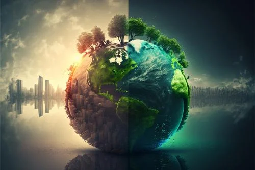
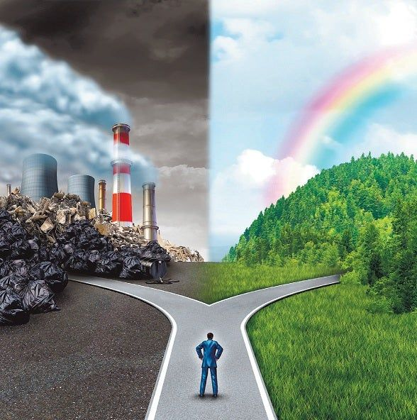

## 1.3. Impacto de los actuales problemas medioambientales

  Por culpa sobre la poca noción sobre los problemas mediambientales, ocurrirán una serie de catastrofes:

# El calentamiento global

  Dadas las actividades del pasado y las actuales, se han ido incrementando las emisiones de C02. Con esto lo que va a ocurrir es que las temperaturas se iran incrementando conforme vaya pasando el tiempo. Para parar esto, todos los países tienen que asumir una serie de responsabilidades para reducir la emisión de C02 y más gases.

# Contaminación

  La OMS estima que casi toda la población respira aire contaminado, el agua que consumimos también esta contaminada, y las tierras son mas yermas que nunca, reduciendo así el cultivo y la alimentación narutal.

Tenemos que reducir la polución para contraer menos enfermedades respiratorias.

Reducir los vertidos a los ríos y mares, de tanto empresas como de individuos, porque el agua potable no es ilimitada.

Al estar trabajando con la tierra, eso produce que esta misma deje de ser útil para la agricultura y la ganadería.

# Deforestación

  Al haber tanta explotación en África y América del Sur, ocurre una deforestación masiva. También debido a el aumento de las temperaturas, ocurren una gran cantidad de incendios. Para solucionar esto, varias industrias tendrían que estar coordinadas.

# Pérdida de biodiversidad

  Debido a la extinción del 8% de las especies animales conocidas, se ha perdido mucha biodiversidad. La destrucción de sus habitats y ecosistemas, por culpa de la construcción de mas edificios. Hay que mantener lo máximo posible de naturaleza intacta, para poder ayudar a que los ecosistemas.

# Sequía
 
  Con la subida de temperaturas, los diferentes climas son mas extremos, y provocan daños mucho mayores si tuvieramos temperaturas normales.

# Consumo abusivo

  Por culpa de la obsolescencia programada, los aparatos electrónicos solamente duran una cantidad corta de años. Con esto aumentamos el consumo de recursos a una velocidad mayor.

# Residuos

  No es una sorpresa que tengamos que compreternos mas con la reduccióin de residuos, tenemos que aplicar las 3Rs

# Superpoblación

  Según la ONU, para el 2050 seremos 9700 millones de personas, provocando así un aumento de consumo de recursos, pérdida de biodiversidad por culpa de la edificación masvia en todo el mundo, etc.
  Llegará un momento, en el cual no tengamos ni agua potable.

# Invasión y tráfico ilegal de especies

  Con el tráfico ilegal, la gente mezcla diferentes animales, sin tener en cuenta que eso puede afectar a el ecosistema, pudiendo incluso terminar en plagas, porque la nueva especie introducida, no tiene depredadores naturales. También provoca que las especies se muevan de territorios y continuamos con la cadena.

# Desconexión social

  Vivimos en sociedad, por lo tanto tenemos que aportar nuestro granito de arena para ayudar con esto, aunque creamos que no estamos haciendo nada, si todos cumplimos con lo mínimo que se pide, solucionaremos muchos problemas.
